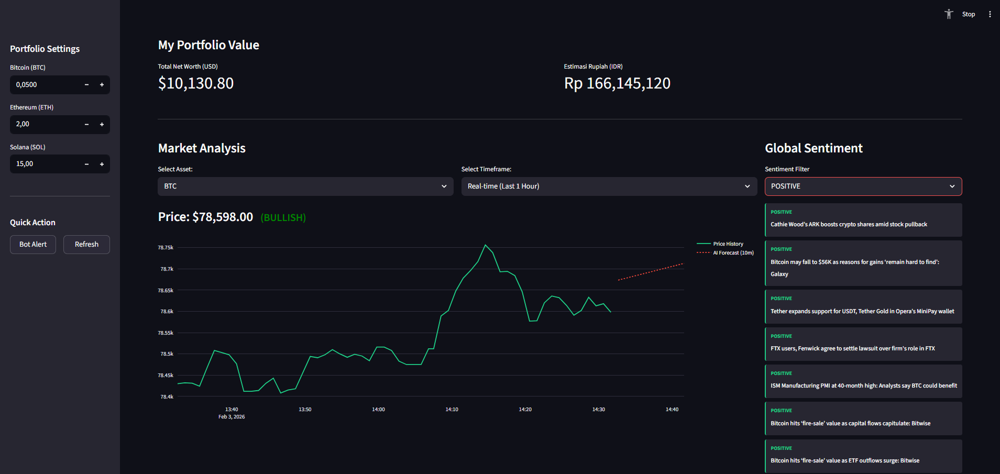

# Market Sentinel: AI-Powered Crypto Monitoring System


**Market Sentinel** is a self-hosted, microservices-based cryptocurrency monitoring system designed for reliability and automation. It leverages **Machine Learning (Linear Regression)** for short-term price forecasting and a **Smart Hybrid Alert System** to detect market crashes and reversals without notification spam.

Built to run 24/7 on a home server, orchestrating data ingestion, storage, analysis, and visualization.

---

## Dashboard Preview

---

## Key Features

### 1. AI-Driven Price Prediction
* Uses **Linear Regression (Scikit-Learn)** to analyze the last 60 minutes of price action.
* Forecasts price trends for the next 10 minutes with visual indicators (**Bullish/Bearish**).
* Hybrid visualization: View 7-day history while AI focuses on short-term high-frequency data.

### 2. Smart Hybrid Alerting (Dual Tracker)
* **Panic Detector (Trailing Stop):** Alerts when price drops significantly from the session's *High Water Mark*.
* **Reversal Detector (Buy the Dip):** Alerts when price bounces up significantly from the session's *Low Water Mark*.
* **Anti-Spam Logic:** Dynamic thresholds automatically adjust to market volatility, preventing alert fatigue.

### 3. Portfolio Tracker
* Real-time Net Worth calculation in **USD** and **IDR**.
* Customizable asset holdings via Sidebar Input.
* Auto-refreshing market data via CoinGecko API.

### 4. Enterprise-Grade Infrastructure
* **Microservices Architecture:** Separated containers for Ingestion, API, Database, and Dashboard.
* **Auto-Pilot Ops:** Automated nightly database backups and self-healing Docker containers.
* **Secure Access:** Exposed securely to the public internet via **Cloudflare Tunnel** (Zero Trust).

---

## Tech Stack

| Component | Technology | Description |
| :--- | :--- | :--- |
| **Ingestion** | Python (Custom Script) | Fetches data, calculates logic, sends Telegram alerts. |
| **Database** | PostgreSQL 15 | Stores historical price data and logs. |
| **Backend API** | FastAPI | Serves data to the frontend. |
| **Frontend** | Streamlit + Plotly | Interactive dashboard for visualization & AI charts. |
| **DevOps** | Docker Compose | Orchestration of 5 interconnected services. |
| **Network** | Cloudflare Tunnel | Secure remote access without opening router ports. |

---

## Project Structure

```text
market-sentinel/
├── backups/                 # Automated DB backups (Ignored by Git)
├── services/
│   ├── api/                 # FastAPI Backend
│   ├── dashboard/           # Streamlit Frontend (AI Logic here)
│   └── ingestion/           # Data Fetcher & Alert Bot
├── .env.example             # Template for environment variables
├── backup_db.sh             # Cronjob script for backups
├── docker-compose.yml       # Service orchestration
└── requirements.txt         # Python dependencies
